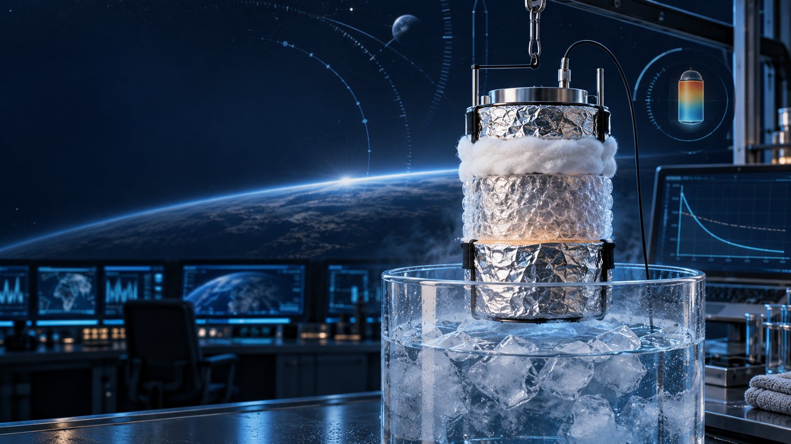

<div align="center">

# SPHERE

### Thermal Insulation Laboratory

**An interactive undergraduate engineering experiment for modelling, measuring and evaluating transient cooling.**

[](https://hsp-mc.github.io/)
[](#learning-outcomes)
[](#safety)



[Launch Lab](https://hsp-mc.github.io/) · [Student Manual](resources/manuals/SPHERE_Mission_Control_Student_Manual.pdf) · [Teacher Manual](resources/manuals/SPHERE_Mission_Control_Teacher_Manual.pdf) · [Task Sheet](resources/worksheets/student_task_sheet.pdf) · [Flashcards](resources/flashcards/SPHERE_Mission_Control_Flashcards.pdf)

</div>

---

## Mission overview

SPHERE is an undergraduate engineering laboratory demonstrator for comparing the transient cooling behaviour of insulated water capsules. It combines a controlled ice-water-bath experiment with a lumped-parameter Newton cooling model, manual temperature acquisition and error analysis.

Students construct a layered test article, predict its temperature response, collect measurements and evaluate how well a simplified mathematical model represents the physical system.

| Experiment element | Role |
| :--- | :--- |
| **Warm-water capsule** | Protected thermal mass |
| **Cotton, bubble wrap and reflective film** | Interchangeable insulation system |
| **Ice-water bath** | Repeatable low-temperature boundary |
| **Temperature probe** | Time-series measurement input |
| **Newton cooling model** | Reference prediction for comparison |
| **Residuals and MAE** | Measures of model agreement |

> [!NOTE]
> The experiment is inspired by layered spacecraft thermal control, but the ice-water bath is a terrestrial conductive and convective environment—not a simulation of vacuum.

## Learning outcomes

After completing the laboratory, students should be able to:

- distinguish conduction, convection and radiation within the test system;
- apply Newton's law of cooling and interpret an effective cooling constant;
- construct a controlled insulated test article;
- acquire and present time-series temperature measurements;
- calculate residuals and mean absolute error (MAE); and
- evaluate experimental uncertainty and the limitations of a lumped-parameter model.

## Laboratory workflow

| Stage | Mission task | Student output |
| :---: | :--- | :--- |
| **01** | Review heat-transfer theory and the mission briefing | Initial understanding and safety check |
| **02** | Assemble the insulated capsule | Repeatable test article |
| **03** | Calculate the reference cooling curve | Predicted temperature history |
| **04** | Run the ice-bath experiment | Recorded time–temperature data |
| **05** | Compare prediction and measurement | Residuals, graph and MAE |
| **06** | Evaluate results and limitations | Engineering conclusion |

## Engineering model

The reference temperature curve follows Newton's law of cooling:

$$
T(t)=T_{\mathrm{env}}+(T_0-T_{\mathrm{env}})e^{-kt}
$$

where:

| Symbol | Meaning | Unit |
| :---: | :--- | :---: |
| $T(t)$ | Modelled capsule temperature at time $t$ | $^\circ\mathrm{C}$ |
| $T_{\mathrm{env}}$ | Ice-bath environment temperature | $^\circ\mathrm{C}$ |
| $T_0$ | Initial capsule temperature | $^\circ\mathrm{C}$ |
| $k$ | Effective system cooling constant | $\mathrm{min}^{-1}$ |
| $t$ | Elapsed time | $\mathrm{min}$ |

The effective cooling constant $k$ describes the response of the complete test system. It must not be confused with material thermal conductivity, denoted by $\lambda$ and expressed in $\mathrm{W/(m\cdot K)}$.

Model agreement is evaluated using mean absolute error:

$$
\mathrm{MAE}=\frac{1}{n}\sum_{i=1}^{n}\left|T_{\mathrm{meas},i}-T_{\mathrm{model},i}\right|
$$

The supplied cooling constants are educational reference values. Repeated measurements are required before they can be presented as validated empirical results.

## Project resources

| Resource | Web version | Printable version |
| :--- | :---: | :---: |
| Interactive laboratory | [`index.html`](index.html) | — |
| Student manual | [Web](resources/manuals/student_manual.html) | [PDF](resources/manuals/SPHERE_Mission_Control_Student_Manual.pdf) |
| Teacher manual and marking guide | [Web](resources/manuals/teacher_manual.html) | [PDF](resources/manuals/SPHERE_Mission_Control_Teacher_Manual.pdf) |
| Laboratory task sheet | [Web](resources/worksheets/student_task_sheet.html) | [PDF](resources/worksheets/student_task_sheet.pdf) |
| Revision flashcards | [Web](resources/flashcards/flashcards.html) | [PDF](resources/flashcards/SPHERE_Mission_Control_Flashcards.pdf) |

The learning materials share one ten-question assessment framework: ten printable inquiries, ten online evaluation questions and a complete instructor solution key. Nine online multiple-choice items are scored automatically; Question 4 requires instructor review.

## Run locally

Clone the repository and start a static web server from the project directory:

```bash
git clone https://github.com/hsp-mc/hsp-mc.github.io.git
cd hsp-mc.github.io
python3 -m http.server 8000
```

Open [http://localhost:8000](http://localhost:8000) in a current browser. Most features also work when `index.html` is opened directly, but a local server provides more consistent browser behaviour.

### Browser dependencies

The interface loads KaTeX, Chart.js, Lucide icons and web fonts from public content-delivery networks. An internet connection is required for complete rendering unless those dependencies are bundled locally.

> [!TIP]
> GitHub renders the equations in this README from LaTeX-style Markdown automatically. The interactive laboratory uses KaTeX for its in-page mathematical notation.

## Experimental limitations

- The ice-water bath does not reproduce heat transfer in vacuum.
- The cotton, bubble-wrap and reflective-film assembly is not flight-qualified multilayer insulation.
- The model assumes uniform capsule temperature and constant boundary conditions.
- Probe position, bath temperature, layer compression, leakage and timing affect repeatability.
- The instructor access-code screen is a client-side classroom gate, not a security mechanism.

## Safety

> [!WARNING]
> This experiment uses water at approximately **80 °C**. A local risk assessment, instructor supervision, a stable working area, eye protection and heat-resistant gloves are required.

- Do not use boiling water.
- Inspect and leak-test every capsule before immersion.
- Keep the hot-water vessel stable and away from bench edges.
- Follow the institution's laboratory rules and emergency procedures.

## Project team

- Piyath Vithanage
- Elio Krollpfeiffer
- Dilan Fernando
- Nuhansee Migelhewage

---

<div align="center">

**SPHERE · Observe the transient response. Test the model. Explain the difference.**

</div>
